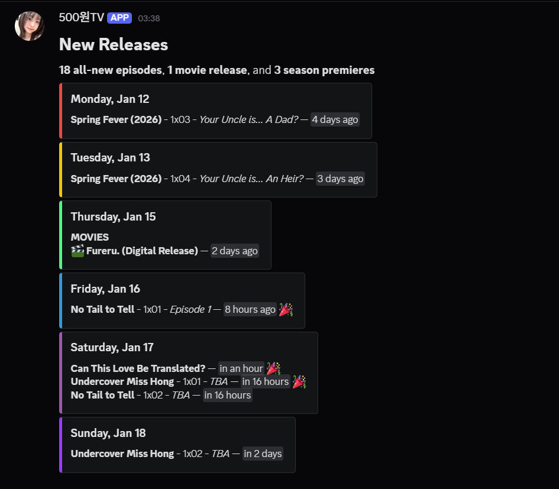
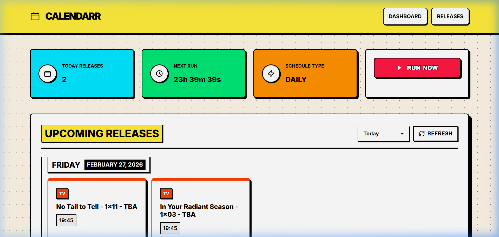

# 📆 Calendarr

A simple Docker container that fetches upcoming airings/releases for TV shows and movies from Sonarr and Radarr calendars and posts them to Discord on a schedule.

> [!NOTE]
> This repository is a fork of [jordanlambrecht/calendarr](https://github.com/jordanlambrecht/calendarr).



## ✨ Features

- **Web UI**: Beautiful dashboard to view upcoming events, trigger manual runs, and view configuration.
- **Consolidated Feed**: Combines multiple Sonarr and Radarr calendar feeds into one summary.
- **Smart Grouping**: Groups shows and movies by day of the week for easy reading.
- **Flexible Scheduling**: Runs on a customizable schedule (Daily or Weekly) or Cron expression.
- **Multi-Platform**: Supports both Discord and Slack notifications.
- **Localization**: Native support for English (EN), Korean (KO), Japanese (JA), and Indonesian (ID).
- **Dynamic Timezones**: Automatically adapts to your configured timezone.
- **Highly Customizable**: Configure headers, footers, timestamp styles, and more.

## 🌐 Web UI

Calendarr now includes a modern Web UI for easy management and visualization!

### Accessing the Web UI

Once your container is running, access the Web UI at:
```
http://localhost:5000
```

Or if running on a remote server:
```
http://YOUR_SERVER_IP:5000
```

### Web UI Features

- **📊 Dashboard**: View statistics including upcoming events count, next scheduled run, and schedule type
- **📅 Calendar View**: See all upcoming TV shows and movies grouped by day with color-coding
- **⚡ Manual Trigger**: Run the calendar job on-demand with a single click
- **⚙️ Configuration Viewer**: View all current settings and platform configurations
- **🔄 Auto-Refresh**: Events automatically refresh every 60 seconds
- **🎨 Modern Design**: Bold Neobrutalist UI with high contrast, vibrant colors, and sharp shadows



## 🚀 Getting Started

Available via `ghcr.io/khw315/calendarr:latest`.

### 🐳 With Docker Compose (Recommended)

1.  **Create a `docker-compose.yml`**:

```yaml
services:
  calendarr:
    image: ghcr.io/khw315/calendarr:latest
    container_name: calendarr
    restart: unless-stopped
    ports:
      - "5000:5000"  # Web UI - Access at http://localhost:5000
    volumes:
      # Mount config directory to save settings from Web UI
      - ./calendarr/config:/app/config:rw
      # Mount logs directory (optional but recommended)
      - ./calendarr/logs:/app/logs:rw
```

2.  **Run it**:
```bash
docker compose up -d
```

3.  **Configure it**: Open `http://localhost:5000` to access the Web UI and set up your webhooks, schedules, and calendars!

### ⌨️ With Docker CLI

```bash
docker run -d \
  --name calendarr \
  -p 5000:5000 \
  -v ./calendarr/config:/app/config:rw \
  -v ./calendarr/logs:/app/logs:rw \
  ghcr.io/khw315/calendarr:latest
```

### 🏃‍➡️ To Run Offschedule 

1. Start the container via the compose file with `docker compose up -d`
2. Use the command `docker exec -it calendarr python src/main.py`

## 🛠️ Configuration

Configure the application directly from the **Web UI**! All changes apply instantly without requiring container restarts and are saved persistently to your mapped `/app/config` volume. 

The following settings are available in the Settings tab:

| Setting Group | Settings Available |
| :--- | :--- |
| **Calendars** | Add multiple Sonarr/Radarr calendar iCal URLs and define their media type (`tv` or `movie`). |
| **Integrations** | Enable Discord or Slack notifications, input your Webhook URLs, and configure mention instructions/styles. |
| **Format** | Customize language, headers, and footer toggles. |
| **Event Display** | Define how past/duplicate events are handled, toggle 24-hour time, and timezone display options. |
| **Schedule** | Set the timezone, Daily/Weekly schedule, specific Run Time, or provide a raw Cron expression. |
| **Advanced** | Toggle system debug logging, max log sizes, and HTTP timeouts. |

*(Note: Advanced users can optionally pre-seed configurations via environment variables, but the Web UI is recommended for all typical modifications.)*

## 🤝 Obtaining Calendar URLs

### Sonarr / Radarr
1.  Go to **Settings** > **General**.
2.  Copy your **API Key**.
3.  Construct your URL:
    *   **Sonarr**: `http://YOUR_HOST:8989/feed/v3/calendar/Sonarr.ics?apikey=YOUR_API_KEY`
    *   **Radarr**: `http://YOUR_HOST:7878/feed/v3/calendar/Radarr.ics?apikey=YOUR_API_KEY`

*Alternatively, use the "Calendar > iCal Link" button in the UI (ensure no tags/filters are selected).*

## ✍️ Custom Footers

You can inject custom markdown into the footer of your messages.

1.  Set `ENABLE_CUSTOM_DISCORD_FOOTER=true` (or Slack equivalent).
2.  Mount a volume to `/app/custom_footers`:
    ```yaml
    volumes:
      - ./custom_footers:/app/custom_footers:rw
    ```
3.  Edit the generated `discord_footer.md` or `slack_footer.md` in that directory.

## 🚧 Development

To build the container locally:

```bash
git clone https://github.com/khw315/calendarr.git
cd calendarr
docker build -t calendarr .
```

## 🧑‍💻 Contributing

Contributions are welcome!
- **Localization**: Help us translate Calendarr into more languages by adding to `src/data/locales.json`.
- **Features**: Submit PRs for new platform integrations or improvements.

## 🧑‍⚖️ License

[GNU General Public License v3.0](LICENSE)
