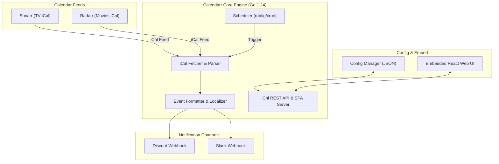

> [!NOTE]
> This repository is a fork of [jordanlambrecht/calendarr](https://github.com/jordanlambrecht/calendarr), rewritten from Python into **Go 1.24** for minimal resource usage (~25MB Docker image), high concurrency, and instant execution.

# Calendarr

A simple, ultra-lightweight Docker container built in **Go** that fetches upcoming airings and releases for TV shows and movies directly from your **Sonarr** and **Radarr** calendars, and seamlessly posts them to **Discord** or **Slack** on a flexible schedule.


## Architecture & Data Flow

Calendarr is architected as an all-in-one, single-binary Go application with an embedded React frontend and a concurrent worker engine.



### Component Breakdown & Data Flow

1. **Calendar Ingestion (`iCal Fetcher & Parser`)**: Concurrently fetches iCal feeds from Sonarr (TV shows) and Radarr (Movies) over HTTP, parsing `VEVENT` components, handling parameter-rich `DTSTART`/`DTEND` timezones, and deduplicating cross-feed entries.
2. **Core Scheduler (`robfig/cron/v3`)**: Controls execution triggers based on configured Daily, Weekly, or custom Cron schedules, as well as instant manual triggers from the Web UI.
3. **Formatter & Localizer (`Event Formatter`)**: Transforms raw calendar events into rich, formatted Markdown payloads for Discord and Slack webhooks, applying dynamic localized date headers, timezone offsets, relative countdown timestamps (`<t:TIMESTAMP:R>`), and custom footers.
4. **Chi REST Router & Embedded SPA (`go-chi/chi/v5`)**: Serves the REST API (`/api/releases`, `/api/past-releases`, `/api/config`, `/api/trigger`) and renders the embedded single-page React Web UI directly from binary memory (`//go:embed`).
5. **Config Manager (`JSON Storage`)**: Provides atomic thread-safe reads and writes to persistent configuration files (`/app/config/calendarr.json`) mounted on host volumes.

---

## Key Features

- **High-Performance Go Engine**: Rewritten in Go 1.24 using `go-chi/chi/v5` for REST API routing and `robfig/cron/v3` for concurrent background scheduling.
- **Embedded Web UI**: A bold Neobrutalist dashboard built with React + TypeScript embedded directly into the Go binary (`//go:embed`). No secondary node server required.
- **Consolidated Feed**: Combines multiple Sonarr and Radarr calendar iCal feeds concurrently into one clean summary.
- **Smart Grouping**: Groups upcoming shows and movies intelligently by day of the week with TV vs. Movie badges.
- **Flexible Scheduling**: Choose Daily summaries, Weekly recaps, or custom Cron expressions with optional run-on-startup.
- **Multi-Platform Integrations**: Effortlessly dispatch notifications to Discord and Slack Webhooks.
- **Localization**: Native translation support for English (EN), Korean (KO), Japanese (JA), and Indonesian (ID).
- **Dynamic Timezones**: Automatically adapts all outputs and schedules to your configured timezone.

---

## Web UI Dashboard

Calendarr features an embedded Web UI for visualization and live configuration without requiring container restarts or editing raw JSON files.

### Accessing the Dashboard
Once the container is running, access the dashboard at:
```text
http://localhost:5000
```

### Dashboard Capabilities
- **Overview Analytics**: View upcoming release counts, next cron run time, and schedule status.
- **Live Calendar View**: Browse upcoming releases grouped by day with color-coded tags.
- **Manual Automation Trigger**: Force-run synchronization instantly via the "Run Now" button.
- **Dynamic Configuration**: Modify calendar URLs, webhook endpoints, timezone, and schedule settings on the fly.


---

## Getting Started

The official multi-architecture Docker image is available via `ghcr.io/khw315/calendarr:latest`.

### Option 1: Docker Compose (Recommended)

1. **Create your `docker-compose.yml`**:
```yaml
services:
  calendarr:
    image: ghcr.io/khw315/calendarr:latest
    container_name: calendarr
    restart: unless-stopped
    ports:
      - "5000:5000"
    volumes:
      - ./calendarr/config:/app/config:rw
      - ./calendarr/logs:/app/logs:rw
```

2. **Spin up the container**:
```bash
docker compose up -d
```

3. **Configure the App**: Navigate to `http://localhost:5000` to set up your Sonarr/Radarr calendar URLs, timezone, and Webhook integrations.

### Option 2: Docker CLI

```bash
docker run -d \
  --name calendarr \
  -p 5000:5000 \
  -v ./calendarr/config:/app/config:rw \
  -v ./calendarr/logs:/app/logs:rw \
  ghcr.io/khw315/calendarr:latest
```

### Manual Trigger (API)

Trigger an instant synchronization run via HTTP POST:
```bash
curl -X POST http://localhost:5000/api/trigger
```

---

## Application Configuration

All settings are managed dynamically through the **Web UI** and automatically saved to `/app/config/calendarr.json`.

| Settings Panel | Description |
| :--- | :--- |
| **Calendars** | Add Sonarr or Radarr `iCal` feed URLs and assign media types (`tv` or `movie`). |
| **Integrations** | Enable/disable Discord and Slack webhooks, define Webhook URLs, and role mentions. |
| **Format** | Choose primary locale (EN, ID, JA, KO), subheader formatting, and custom footers. |
| **Event Display** | Handle duplicate events, 24-hour timestamps, and past event visibility (`DISPLAY`, `HIDE`, `STRIKE`). |
| **Schedule** | Configure Daily runs, Weekly recaps, exact run times, or custom Cron expressions. |
| **Advanced** | Developer options for HTTP timeouts, log retention, and debug mode. |

---

## Syncing Sonarr / Radarr Feeds

Calendarr parses standard `iCal` (.ics) feed endpoints from Sonarr and Radarr.

1. Open **Sonarr** or **Radarr**.
2. Navigate to **Calendar** > click **iCal Link** (or generate from **Settings** > **General** API Key).
3. Copy the URL format:
   - **Sonarr**: `http://YOUR_HOST:8989/feed/v3/calendar/Sonarr.ics?unmonitored=true&apikey=YOUR_API_KEY`
   - **Radarr**: `http://YOUR_HOST:7878/feed/v3/calendar/Radarr.ics?unmonitored=true&apikey=YOUR_API_KEY`
4. Paste the URL into Calendarr's Web UI under **Settings** > **Calendars**.

---

## Local Development

### Prerequisites
- **Go**: 1.24+
- **Node.js**: 20+ & `npm`

### 1. Build Frontend UI
```bash
cd frontend
npm install
npm run build
cd ..
```

### 2. Run Backend Server
```bash
go run main.go
```
The server will start at `http://localhost:5000`.

### 3. Run Unit Tests & Linting
```bash
go vet ./...
go test -v ./...
```
